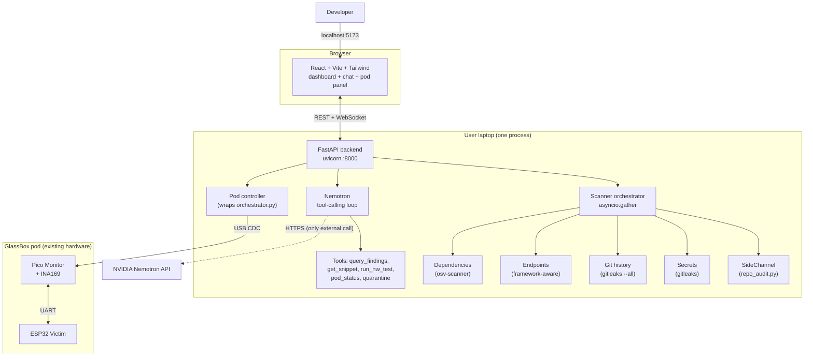

# GlassBox Audit Platform

A local-first vulnerability auditor for any code repository, with a hardware-in-the-loop confirmation step that no purely-software competitor can match.

Point it at any repo. Five scanners run in parallel. Findings stream into a dashboard. A Nemotron-powered chat agent answers questions about your code, cites specific findings, and -- for C/C++ side-channel leaks -- can drive the GlassBox pod to physically confirm the leak on real silicon.

> Status: design complete, build in progress. See "Build phases" at the bottom for what's shipping when. The existing CLI tooling under [glassbox/runner/](../runner/) is unchanged and continues to work standalone.

## Why this is different

Every existing repo scanner stops at static analysis. They tell you "this looks risky." We can tell you "this looks risky, AND we measured it leaking 47 cycles per byte on real hardware, here's the t-statistic." That second sentence is the moat.

Concretely, the platform combines five scanners (one of which is the existing GlassBox side-channel auditor) into a single dashboard, then offers a button on every C/C++ side-channel finding that says "Confirm on hardware." Click it and the existing GlassBox pod runs the function under TVLA on a deterministic ESP32 and streams the verdict back into the UI.

## Architecture




One Python process on the laptop hosts the API, runs all scanners, and talks to the pod over USB. The browser is just a thin UI. The only outbound network call is to NVIDIA's hosted Nemotron endpoint.

## Tech stack

| Layer            | Choice                                                                                  | Why |
| ---------------- | --------------------------------------------------------------------------------------- | --- |
| Frontend         | React 18 + Vite + TypeScript + Tailwind + shadcn/ui                                     | SPA only, no SSR overhead, fastest cold start |
| Backend          | FastAPI + uvicorn + asyncio                                                             | Same language as scanners, first-class WebSockets |
| LLM              | NVIDIA Nemotron via [build.nvidia.com](https://build.nvidia.com) (OpenAI-compatible)    | Free credits, tool-calling support, no local GPU |
| Embeddings + RAG | `nvidia/nv-embedqa-e5-v5` + FAISS in-memory                                             | Zero infra, fits in 100MB RAM for any realistic repo |
| Side-channel     | Existing [runner/repo_audit.py](../runner/repo_audit.py)                                | Already built, multi-language, JSON output |
| Secrets          | [gitleaks](https://github.com/gitleaks/gitleaks)                                        | Single binary, 100+ rules, fast, low FP rate |
| Git history      | gitleaks `--log-opts="--all"`                                                           | Same tool, finds secrets that were "removed" but still in history |
| Endpoints        | Custom Python (regex + tree-sitter)                                                     | Framework-aware: FastAPI, Flask, Express, Next.js |
| Dependencies     | [osv-scanner](https://github.com/google/osv-scanner)                                    | One tool covers npm/pip/cargo/go/maven against OSV.dev |
| Hardware         | Existing [runner/orchestrator.py](../runner/orchestrator.py)                            | Already AI-driveable, structured JSON output |
| Persistence      | JSON files in `~/.glassbox/runs/<run_id>/`                                              | Hackathon scope; trivial upgrade to SQLite later |

## What it scans for

### 1. Side-channel leaks (any language)
Catches the canonical timing-leak shapes in source code: early-exit byte compares (`strcmp_naive`), `==` on secret-named values, secret-indexed table lookups (cache-timing risk), branches gated on secrets, and length-oracle loops. Works on Python, JavaScript, TypeScript, C, C++, Rust, Go, Java. See [agent-repo-audit-guide.md](agent-repo-audit-guide.md) for the underlying tool.

### 2. Secrets / API keys / tokens
Plaintext AWS keys, Google API keys, GitHub PATs, Slack tokens, JWTs, private keys (RSA/EC/PGP), database connection strings with passwords, ~100 other patterns via gitleaks.

### 3. Git history secrets
Finds secrets that were committed, then "removed" in a later commit but still live in the git history (the most common real-world leak pattern). Scans every commit, every branch, every blob.

### 4. Exposed endpoints
Discovers route handlers in FastAPI (`@app.get`, `@router.post`, etc.), Flask (`@app.route`), Express (`app.get`), and Next.js (`app/api/*/route.ts`). Flags routes that:
- Return objects containing secret-named fields without explicit allow-listing
- Echo error stack traces in responses
- Lack auth decorators / middleware on endpoints that touch user data
- Bind to `0.0.0.0` or have `cors: *`

### 5. Vulnerable dependencies
Cross-ecosystem dependency audit against the OSV database. Covers `package.json`, `requirements.txt`, `Pipfile.lock`, `Cargo.toml`, `go.mod`, `pom.xml`. Maps CVSS to our severity tiers.

### 6. Hardware confirmation (C/C++ side-channels only)
On-demand. Click "Confirm on hardware" on any side-channel finding in C/C++. The platform extracts the function, drops it into the firmware harness, prompts you to reflash, and runs TVLA on real cycle counts plus power traces. The verdict gets attached to the finding as additional evidence.

## The Nemotron chat agent

The chat panel is a tool-calling loop over Nemotron with seven tools:

| Tool                       | Purpose |
| -------------------------- | ------- |
| `list_findings`            | Filter by severity, scanner, file |
| `get_finding`              | Pull full detail on one finding by ID |
| `get_file_snippet`         | Read N lines around any file:line |
| `search_repo`              | Semantic search over findings + code (RAG via FAISS) |
| `run_hardware_test`        | Trigger pod confirmation for a side-channel finding |
| `pod_status`               | Check if the GlassBox pod is alive / quarantined |
| `quarantine_pod` / `release_pod` | Manual hardware control |

Things you can actually ask the agent:

- "What should I fix first and why?"
- "Show me every place we touch the user's password"
- "Are any of these CVEs actually reachable from a public endpoint?"
- "Confirm the timing leak in `check_password` on hardware"
- "Generate a patch for the `==` comparison on line 42"
- "Has this API key ever been in our git history?"

Each response includes citation chips that link back to the dashboard.

## Unified `Finding` schema

Every scanner emits the same shape, so the frontend, agent, and persistence layer are all scanner-agnostic.

```python
@dataclass
class Finding:
    id: str
    scanner: str               # sidechannel | secrets | git_history | endpoints | deps | hardware
    severity: Severity         # CRITICAL | HIGH | MEDIUM | LOW
    title: str
    description: str
    file: Optional[str]
    line: Optional[int]
    snippet: Optional[str]
    advice: str
    evidence: dict             # scanner-specific metadata
    can_hw_confirm: bool       # true only for sidechannel + C/C++
```

## Repo layout (after build)

```
glassbox/
  server/                            FastAPI backend [NEW]
    app.py                           app + route registration
    main.py                          uvicorn entry point
    storage.py                       ~/.glassbox/runs/ persistence
    routes/
      audits.py                      POST/GET /audit, WS /audit/{id}/events
      chat.py                        WS /chat (Nemotron tool loop)
      pod.py                         /pod/status, /pod/run, /pod/quarantine
    scanners/
      base.py                        Scanner ABC, Finding dataclass
      sidechannel.py                 wraps runner/repo_audit.py
      secrets.py                     wraps gitleaks
      git_history.py                 wraps gitleaks --log-opts="--all"
      endpoints.py                   framework-aware route discovery
      deps.py                        wraps osv-scanner
      hardware.py                    wraps runner/orchestrator.py (on-demand)
    agent/
      nemotron_client.py             OpenAI-compatible wrapper
      tools.py                       7 tool schemas + dispatcher
      rag.py                         FAISS index over findings + snippets
  web/                               React frontend [NEW]
    package.json
    vite.config.ts
    src/
      App.tsx
      pages/AuditPage.tsx            repo input + findings dashboard
      pages/ChatPage.tsx             Nemotron chat
      components/
        FindingCard.tsx
        ScannerProgress.tsx
        PodPanel.tsx                 live status + manual quarantine
        HardwareConfirmButton.tsx
      lib/api.ts, lib/ws.ts
  runner/                            unchanged -- still usable as standalone CLI
  esp/, raspberry/                   firmware unchanged
```

## Quick start

### Prerequisites

```bash
# System tools
brew install gitleaks                                # macOS
brew install osv-scanner

# Python (existing GlassBox setup)
cd glassbox/runner
python -m venv .venv && source .venv/bin/activate
pip install -r requirements.txt
pip install fastapi uvicorn[standard] httpx faiss-cpu pydantic

# Node (frontend)
cd ../web
npm install
```

### NVIDIA API key

1. Sign up at [build.nvidia.com](https://build.nvidia.com) (free, gives credits)
2. Generate an API key
3. Export it:

```bash
export NVIDIA_API_KEY=nvapi-xxxxxxxxxxxx
```

### Run

Terminal 1 (backend + scanners + pod controller):

```bash
cd glassbox
python -m server.main
# -> uvicorn running on http://localhost:8000
```

Terminal 2 (frontend dev server):

```bash
cd glassbox/web
npm run dev
# -> http://localhost:5173
```

Open `http://localhost:5173`, paste a repo path or git URL, click "Audit."

### Hardware (optional, for confirmation step)

Plug the GlassBox pod into USB. The backend auto-detects the Pico CDC port on first request. To verify before running an audit:

```bash
curl http://localhost:8000/pod/status
# {"alive": true, "port": "/dev/cu.usbmodem1101", "quarantined": false}
```

## Usage walkthrough

1. **Start an audit.** Paste `/path/to/repo` or `https://github.com/org/repo`. The backend clones (if URL) or copies (if path) into `~/.glassbox/runs/<run_id>/repo/`.
2. **Watch findings stream in.** Five scanner cards each show progress; findings appear in the table as soon as each scanner completes. Total time on a 1000-file Python repo: roughly 30 seconds.
3. **Triage.** Sort by severity, filter by scanner, click any finding for the snippet + advice + evidence.
4. **Ask the agent.** Open the chat panel and ask anything. The agent has full read access to the run's findings, can pull file snippets, and can search semantically over the repo.
5. **Confirm on hardware (optional).** Any C/C++ side-channel finding has a "Confirm on hardware" button. Click it; the platform extracts the function, asks you to reflash the ESP32, then runs TVLA. The verdict streams back into the finding card.
6. **Quarantine demo (optional).** From the pod panel, click QUARANTINE; the ESP32 visibly halts and refuses to run any function until you click RELEASE. Useful for showing the closed-loop in a presentation.

## API reference (essentials)

| Method | Path                              | Purpose                              |
| ------ | --------------------------------- | ------------------------------------ |
| POST   | `/audit`                          | Body: `{path \| git_url}`. Returns `{run_id}`. |
| GET    | `/audit/{run_id}`                 | Final report (or in-progress status) |
| WS     | `/audit/{run_id}/events`          | Stream scanner progress + findings   |
| GET    | `/audit/{run_id}/findings/{id}`   | Single finding detail                |
| WS     | `/chat`                           | Bidirectional Nemotron tool loop     |
| GET    | `/pod/status`                     | Pod alive + quarantined flags        |
| POST   | `/pod/run`                        | Body: `{finding_id}`. Runs orchestrator stages. |
| POST   | `/pod/quarantine`                 | Manual quarantine                    |
| POST   | `/pod/release`                    | Manual release                       |

## Configuration

Environment variables (all optional except `NVIDIA_API_KEY`):

| Var                        | Default                              | Purpose |
| -------------------------- | ------------------------------------ | ------- |
| `NVIDIA_API_KEY`           | -- (required)                        | Nemotron auth |
| `NEMOTRON_MODEL`           | `nvidia/llama-3.3-nemotron-super-49b-v1` | Override model name |
| `NEMOTRON_BASE_URL`        | `https://integrate.api.nvidia.com/v1`| Override endpoint |
| `GLASSBOX_RUNS_DIR`        | `~/.glassbox/runs`                   | Where reports go |
| `GLASSBOX_POD_PORT`        | auto-detect                          | Force a specific serial port |
| `GLASSBOX_SCANNER_TIMEOUT` | `600`                                | Per-scanner timeout (sec) |
| `GLASSBOX_MAX_TOOL_CALLS`  | `8`                                  | Cap per chat turn |

## Limitations (be honest with reviewers)

- Static analysis can identify shape, not exploitability. The hardware confirmation step exists for exactly this reason on side-channel findings.
- Endpoint scanner is heuristic; unconventional frameworks won't be auto-discovered. False positives tolerable, false negatives less so.
- Hardware confirmation requires a manual reflash in v1 (or `arduino-cli` if installed). Auto-flash is on the roadmap.
- Nemotron is hosted; if NVIDIA's endpoint is down, the chat panel is unavailable. Audits themselves continue to work.
- Single-user, single-process. No auth, no multi-tenancy. By design -- this is a developer-local tool, not a SaaS.
- Repos larger than ~10k files may exceed the 10-minute per-scanner cap. Use `--include` / `--exclude` patterns.

## Build phases

| # | Phase                                       | Outcome                                                            |
| - | ------------------------------------------- | ------------------------------------------------------------------ |
| 1 | Backend skeleton + scanner ABC              | `python -m server.main` runs, `/health` responds                   |
| 2 | Wrap 5 scanners                             | `POST /audit` returns unified findings JSON                        |
| 3 | WebSocket streaming + persistence           | Frontend can subscribe to live progress                            |
| 4 | Frontend skeleton + audit dashboard         | Findings render, sortable, filterable                              |
| 5 | Nemotron agent + tool loop + RAG            | Chat works, agent calls tools, cites findings                      |
| 6 | Hardware confirmation flow                  | Click finding -> `orchestrator.py` -> verdict streams to UI        |
| 7 | Example leaky repo + demo polish            | End-to-end demo runs without manual fixups                         |

## Demo script

1. Open `localhost:5173`
2. Paste path to `examples/leaky-app/`
3. Five scanner cards spin up; findings populate within seconds
4. Dashboard shows: 1 CRITICAL side-channel, 3 HIGH secrets, 2 HIGH endpoints, 1 CRITICAL npm CVE
5. Click the side-channel finding -> "Confirm on hardware"
6. Pod LEDs flash, TVLA verdict streams in: "leak confirmed at cycle 47"
7. Open chat: "What should I fix first and why?"
8. Nemotron answers: "Highest impact is the timing leak in `check_password()` -- I confirmed it on hardware (47-cycle gap per byte). Use `hmac.compare_digest`. Next priority: the AWS access key on line 12 of `config.py`, which is also in your git history at commit `abc123`..."
9. Click QUARANTINE in pod panel -- ESP32 visibly halts. Click RELEASE to recover.

## Related docs

- [glassbox/README.md](../README.md) -- project-wide overview, hardware wiring, theory
- [agent-repo-audit-guide.md](agent-repo-audit-guide.md) -- the language-agnostic static auditor (used as the SideChannelScanner)
- [test-arbitrary-code-guide.md](test-arbitrary-code-guide.md) -- step-by-step for testing C/C++ functions on the pod
- [quarantine-demo-guide.md](quarantine-demo-guide.md) -- the closed-loop live attacker demo
